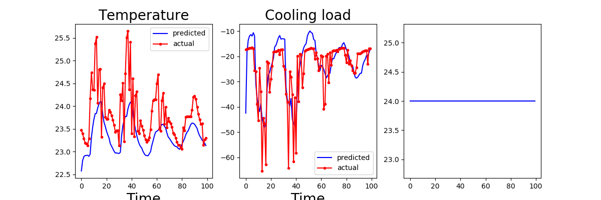

# RL-buildings

This contains basic tools for implementing Reinforcement Learning algorithms and gym environments. Mainly aiming for systems with continious state space and action space.

## gym environments:
- [Two zone building model](gym_env/two_zone_model.py)
## Modeling and Simulations
- ```test.py ``` extracts the model parameters and 
  - verifes the model 
  - simulates a Control barrier based controller where the objective is to maintain the temperature bewtween (22, 23)
  
#Aim: Optimizing the cooling load supplied to the zone using Temeperature setpoint as the decision variable.
