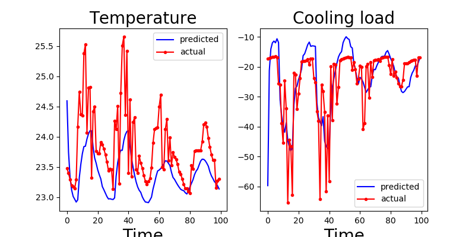

# RL-buildings

This contains basic tools for implementing Reinforcement Learning algorithms and gym environments. Mainly aiming for systems with continious state space and action space.

## gym environments:
- [Two zone building model](two_zone_model.py)
- ```model_parameters.py ``` extracts the model parameters and verify the model.

